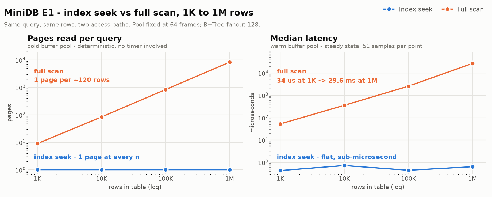

# MiniDB

A small disk-backed relational engine written from scratch in Java — no libraries, no build
tool, no framework. Pages and a disk manager at the bottom, a buffer pool with pluggable
eviction above that, a slotted-page row heap, a B+Tree index, a SQL lexer/parser, and a
Volcano-style query planner that turns `SELECT * FROM users WHERE id = 500` into an iterator
tree and can be forced to choose the wrong plan on purpose so the right one can be measured
against it.

The interesting part is not that it runs queries. It is that every claim below is a number
produced by a harness in this repository, and that the tests are built to fail.

---

## The measurement

<picture>
  <source media="(prefers-color-scheme: dark)" srcset="docs/e1-index-vs-scan-dark.png">
  
</picture>

Same query, same rows, two access paths — the planner is forced onto each in turn. Pool
fixed at 64 frames at every scale, so the pool-as-a-fraction-of-table shrinks as `n` grows,
which is what happens to a real system as data outgrows memory.

| rows | index: pages | scan: pages | index: median | scan: median |
|-----:|-------------:|------------:|--------------:|-------------:|
| 1,000 | 1 | 9 | 0.43 µs | 52.7 µs |
| 10,000 | 1 | 84 | 0.72 µs | 359.4 µs |
| 100,000 | 1 | 834 | 0.44 µs | 2,571 µs |
| 1,000,000 | 1 | 8,334 | 0.64 µs | 26,945 µs |

Pages read is the primary metric because it is deterministic and is the actual algorithmic
quantity. Latency is reported beside it and carries JIT, GC, and OS-cache caveats that page
counts do not. Raw data: [`e1_results.csv`](e1_results.csv).

### Calibration against SQLite

An asymptotic claim inside one engine proves the curve, not the constant. So the same query,
the same four scales, and the same harness rules (20 warmup iterations, 51 samples, adaptive
batching, median reported) were run against SQLite 3.51.2 — in C, linked directly against
`libsqlite3`, because a Python or JDBC call frame would be a large fraction of a
sub-microsecond measurement and would flatter MiniDB by inflating SQLite. The schema is
`WITHOUT ROWID` so `id` is the table's real B-tree key rather than an alias for SQLite's
implicit rowid, and `EXPLAIN QUERY PLAN` is asserted at every `n` — an index arm that
silently degraded to a scan would otherwise publish as a null result.

| rows | mode | MiniDB | SQLite | |
|-----:|:-----|-------:|-------:|:--|
| 1,000 | index | 0.43 µs | 2.08 µs | MiniDB 4.8× faster |
| 10,000 | index | 0.72 µs | 2.10 µs | MiniDB 2.9× faster |
| 100,000 | index | 0.44 µs | 2.14 µs | MiniDB 4.8× faster |
| 1,000,000 | index | 0.64 µs | 2.17 µs | MiniDB 3.4× faster |
| 1,000 | scan | 52.7 µs | 16.0 µs | MiniDB 3.3× slower |
| 10,000 | scan | 359 µs | 138 µs | MiniDB 2.6× slower |
| 100,000 | scan | 2,571 µs | 1,778 µs | MiniDB 1.5× slower |
| 1,000,000 | scan | 26,945 µs | 20,067 µs | MiniDB 1.3× slower |

Both index curves are flat. Both scan curves are linear. The shapes agree, which is the
result worth having.

**MiniDB "winning" the index arm is an artifact, not an achievement.** Its B+Tree lives in
the Java heap, so a descent reads zero pages and decodes no interior nodes; SQLite descends
real pages through its own cache and pager. MiniDB is being credited for a feature it does
not have. The price of that missing feature is measured in [E5](#deliberate-scope) below and
is paid on every single `open()`. The scan arm is the closer comparison — both engines read
every page of the table through their own cache and decode every row — and there MiniDB
lands within about 1.5× of SQLite at the scales where buffer-pool artifacts have washed out.

---

## Architecture

```
  SQL text  ──►  Lexer ──► Parser ──► AST            sql/
                                       │
                                       ▼
                                    Planner          plan/     rewrite: id = k ──► IndexSeek
                                       │                       otherwise ──► Filter over SeqScan
                                       ▼
              Volcano iterator tree: SeqScan │ IndexSeek │ Filter │ Limit
                     open() / next() / close(), one row at a time, pipelined
                                       │
                    ┌──────────────────┴──────────────────┐
                    ▼                                     ▼
              B+Tree index                            Row heap             index/ table/
              int key ──► Rid(page, offset)           slotted pages        record/
                    └──────────────────┬──────────────────┘
                                       ▼
                            BufferPool  (pin / unpin / dirty)              storage/
                            fixed frames, LRU or FIFO eviction
                                       │
                                       ▼
                            DiskManager ──► 4 KB pages on disk
```

Five layers, bottom to top. **`DiskManager`** addresses a file as fixed 4 KB blocks.
**`BufferPool`** caches a fixed number of those blocks in frames, pins them while in use,
flushes them when dirty pages are evicted, and takes its eviction policy as a strategy
(`LruPolicy` / `FifoPolicy`). **`RowPage`** lays a slotted page over the raw bytes — header,
slot array, tuples growing toward each other — at about 120 rows per 4 KB page.
**`Table`** stacks a row heap and a `BPlusTree` mapping `id → Rid(page, offset)`.
**`Planner`** compiles the AST into pipelined iterators, so `LIMIT 3` abandons a scan
mid-page and touches exactly one page instead of seventeen.

---

## Testing

This is the part of the project that took the longest and it is the part a file listing
cannot show. 28 checks currently pass. That number is uninteresting on its own — the
question is what would have to break for one of them to fail.

**Differential testing with an independent oracle.** The planner is forced onto both access
paths for the same query and the two row sets are compared as sets, since `IndexSeek` yields
key order and `SeqScan` yields heap order. A third answer comes from `Table.scanWhere` — the
pre-planner Stage 4 code path, kept alive rather than deleted precisely so it can serve as an
oracle that shares no code with either plan.

**Close / reopen at every layer.** Raw page bytes, a single serialized row, a multi-page
table, and a table whose pool evicted continuously are each written, closed, reopened from
disk, and re-read. Stage 7b goes further and never calls `flushAll`: it dirties a page,
forces it out through eviction alone, then reopens the file to prove the eviction path itself
persisted the bytes.

**Fault injection.** A test suite that has never failed is a suite of unknown value. Six
deliberate faults were written into the predicate layer one at a time, and the whole suite
was run against each to record which tests actually catch them:

| # | Injected fault | Caught by |
|---|---|---|
| F1 | text column ordering allowed via `compareTo` instead of rejected | **8e only** |
| F2 | strict `>` implemented as `>=` | 5d, 8a, 8e |
| F3 | unknown column matches nothing instead of throwing | **8e only** |
| F4 | cross-type literal coerced to `0` instead of rejected | **8e only** |
| F5 | text `!=` uses reference inequality | **8e only** |
| F6 | text `=` uses reference equality | 5d, 8e |

The interesting row is **F1**. Letting `name > 'Ada'` quietly mean `compareTo` is caught by
exactly one test in the suite, and the reason generalizes: the differential test builds both
of its plans from the same `Predicates` class, so a wrong operator would agree with itself
and both arms would return the same wrong rows. Every other test only checks that queries
which *should* return rows return the right ones — and F1 adds behavior where there should be
none, so there is nothing for them to disagree about. Only a test that asserts what the
engine must **refuse** to do can see it. Stage 8e is that test, and F3, F4, and F5 land the
same way. The two faults with wider coverage (F2, F6) are the two that change the answer to a
query some other test already runs.

**The vacuity sweep.** Late in the project every test was re-read with one question: *would
this still pass if the thing it tests did nothing at all?* Five passed for the wrong reason,
including one written the same day:

- The differential test compared `id = 4242` against a table that had no such row. Two plans
  both returning empty "agree" — it would have passed having compared nothing. It now asserts
  the expected row count and that at least five comparisons were non-empty.
- The buffer-pool integration test inserted 150 rows into a pool of capacity 3. All 150 fit
  on one page, so the pool never evicted and "survives constant eviction" was never tested.
  Now 2,000 rows over 13 pages.
- The LRU/FIFO test checked *which* page each policy dropped but never looked at the contents
  of the survivors — a policy that evicted correctly and corrupted everything else would have
  passed. Every page now carries a marker that is verified, including on the evicted page
  after it is re-read from disk.
- The early-termination test asserted `limitedMisses < fullMisses`, which would still hold if
  `LIMIT 3` read half the table. It now asserts exactly 1 page.
- Its pin-leak check relied on eviction starvation, which only appears once *capacity
  distinct* pages are stuck. Repeated `LIMIT` queries all abandon page 0, so they piled pins
  onto one frame and could never starve the pool. The scans are now staggered across
  different pages, and an explicit `assertNoPinnedFrames()` is the real detector.

The benchmark harness carries the same guards: it refuses to run if the index arm did not
actually plan an `IndexSeek`, if the query returns zero rows, or if a `COLD` cell got a batch
size other than 1 — three ways a benchmark can quietly report a null result as a finding.

---

## Deliberate scope

These are missing on purpose. Each one is a fork that was identified, costed, and declined —
with the reason recorded at the time rather than reconstructed now.

**Disk-resident B+Tree nodes.** The index is an in-memory Java structure derived from the
heap, so it is rebuilt in full on every `open()`. That cost is measured by E5, and it is the
single strongest argument for the feature:

| rows | rebuild | = heap scan | + tree inserts | µs/row |
|-----:|--------:|------------:|---------------:|-------:|
| 1,000 | 0.6 ms | 0.2 ms | 0.4 ms | 0.59 |
| 10,000 | 1.5 ms | 0.9 ms | 0.6 ms | 0.15 |
| 100,000 | 13.2 ms | 2.9 ms | 10.3 ms | 0.13 |
| 1,000,000 | **173.0 ms** | 29.6 ms | 143.4 ms | 0.17 |

173 ms before a single query runs, every time the file is opened — to accelerate lookups that
take 0.64 µs. A persistent tree would read ~3 pages per lookup instead of 0, and would read
nothing at all on startup.

The last decade costs **13.1×** rather than 10×, reproducibly (13.32 / 13.29 / 13.12 across
three runs; an early 9.77× reading came from a 7-sample configuration too noisy to conclude
from, now raised to 21). It is not an anomaly, and — despite the arithmetic coincidence that
`10 × 4/3 = 13.3` and the tree height does go from 3 to 4 there — it is **not** the tree
getting taller either. Decomposing it: the heap scan grows 10.1× (linear, as it should) while
the tree inserts grow 14.0×. All of the superlinearity is in the tree half.

The cause is `BPlusTree.childIndex`, which walks an internal node's keys **linearly** instead
of binary-searching them, so one descent costs `(height − 1) × fanout` comparisons — and
because rebuild inserts keys in ascending order, every descent routes to the rightmost child
and therefore scans *every* key of *every* internal node it passes. 100K has 2 internal
levels, 1M has 3, so per-insert work should rise 1.5×; measured, it rises 1.40×. Weighted by
the measured 78/22 split between tree and scan work, that predicts 13.1× — against 13.12×
observed.

A fanout sweep at fixed `n = 1M` is the control, and it settles the question, because holding
`n` fixed leaves height as the only thing moving:

| fanout | height | tree work | vs. fanout 256 | height model | comparison model |
|-------:|-------:|----------:|---------------:|-------------:|-----------------:|
| 256 | 3 | 158.7 ms | 1.00× | 1.00× | 1.00× |
| 128 | 4 | 140.7 ms | 0.89× | 1.33× | 0.75× |
| 32 | 5 | 86.6 ms | **0.55×** | 1.67× | 0.25× |

The *deepest* tree is the *fastest* one. Height alone predicts the exact opposite ordering,
so height is not the mechanism; cost tracks `(height − 1) × fanout`, which is the signature of
the linear scan. (The comparison model overshoots the savings because per-insert work that
does not depend on fanout — leaf binary search, allocation, boxing — dilutes it.) Making
`childIndex` a binary search is a genuine outstanding fix, and it would move the index-seek
latency in E1 as well, so it is left as a change to make deliberately and re-measure, not
quietly before publishing these numbers.

**Page-0 catalog.** The schema `(id, name, age)` is hardcoded in `Row` and `Predicates`.
Persisting a catalog in page 0 means a real type system, variable column counts, and schema
evolution — that is a project, not a stage, and every experiment here needs exactly one table.

**Non-unique index on `age`.** The B+Tree maps one key to one `Rid`. Supporting duplicates
means either RID lists in the leaves or key-suffix uniquification, plus range-scan semantics
across leaf boundaries. `age > 60` is deliberately left as `Filter` over `SeqScan`, which also
keeps E1's two arms cleanly separated.

**WAL and crash recovery.** Durability here is flush-on-eviction and flush-on-close, verified
by reopening the file. Real crash safety needs a log, LSNs, and ARIES-style redo/undo. Without
transactions there is nothing to roll back, so the log would be infrastructure for a feature
that does not exist yet.

---

## Honest caveats

- **The index is in memory, so a descent reads 0 pages.** This is the single largest thumb on
  the scale in E1 and in the SQLite comparison. A real disk-resident B+Tree would read about
  3 pages per lookup at 1M rows. E5 measures what is being paid for that shortcut.
- **One physical read versus a real descent.** MiniDB walks Java objects and then does exactly
  one page read via the RID. SQLite descends its B-tree through actual pages, decoding an
  interior node at each level. The two "index lookups" are not the same operation.
- **Warm OS cache throughout.** The kernel page cache is never dropped between runs — doing so
  is not portable — so `COLD` means a cold *buffer pool*, not cold storage. No number here is
  a disk-I/O measurement.
- **MiniDB re-parses on every query; SQLite uses a prepared statement.** Parse cost is measured
  separately and reported in `e1_results.csv` (`parse_us`). At 1M rows the index query is
  0.64 µs total, of which 0.42 µs is parsing — so MiniDB's execution advantage in that row is
  larger than the table shows, and just as artificial.
- **Single-threaded, single-table, no transactions.** No concurrency control exists, so none
  of these numbers say anything about contention.
- **Not JMH.** JMH is the right tool for JVM microbenchmarking; adopting it means adopting
  Maven, and this project has no build tool by design. The mitigations that matter are applied
  explicitly instead: results feed a sink so queries cannot be optimized away, warmup
  iterations are discarded, batches are sized to clear timer resolution, and medians are
  reported rather than means with min and p95 alongside.

---

## Running it

No build tool, so there is nothing to install. Java 17 or newer:

```bash
# Compile everything
javac -d out/classes $(find src -name "*.java")

# Run the full test suite — 28 checks, stages 1 through 8
java -cp out/classes com.minidb.Main
```

The benchmarks generate their own data into `bench-data/` on first run and cache it
afterwards; the 1M-row table takes a minute or two to build once.

```bash
# Generate/verify the benchmark tables and print their shape
java -cp out/classes com.minidb.bench.DataGen

# E1: index vs scan, 1K..1M            -> e1_results.csv
java -cp out/classes com.minidb.bench.E1IndexVsScan

# E5: index rebuild cost + fanout sweep -> e5_results.csv, e5_fanout.csv
java -cp out/classes com.minidb.bench.E5RebuildCost

# Redraw the chart from the CSV (needs matplotlib)
python3 bench/plot_e1.py
```

The SQLite calibration is a standalone C file, built against the system SQLite:

```bash
gcc -O2 bench/sqlite_calibration.c -lsqlite3 -o /tmp/sqlite_cal && /tmp/sqlite_cal
# -> sqlite_results.csv
```

If your distribution ships SQLite without development headers, link the shared object
directly — the handful of entry points used are declared in the source:

```bash
gcc -O2 bench/sqlite_calibration.c /usr/lib64/libsqlite3.so.0 -o /tmp/sqlite_cal
```

---

## Layout

| Package | Contents |
|---|---|
| `storage/` | `Page`, `DiskManager`, `BufferPool`, `Frame`, `EvictionPolicy` + LRU/FIFO |
| `record/` | `Row`, `RowSerializer`, `RowPage` (slotted page layout) |
| `index/` | `BPlusTree` (search, split, invariant validation), `Rid` |
| `table/` | `Table` — row heap plus index, insert/scan/close |
| `sql/` | `Lexer`, `Parser`, AST types, `Predicates`, `Executor` |
| `plan/` | `Planner`, `Operator`, `SeqScan`, `IndexSeek`, `Filter`, `Limit` |
| `bench/` | `Harness`, `DataGen`, `E1IndexVsScan`, `E5RebuildCost` |
| `Main.java` | The test suite — stages 1–8, run top to bottom |
